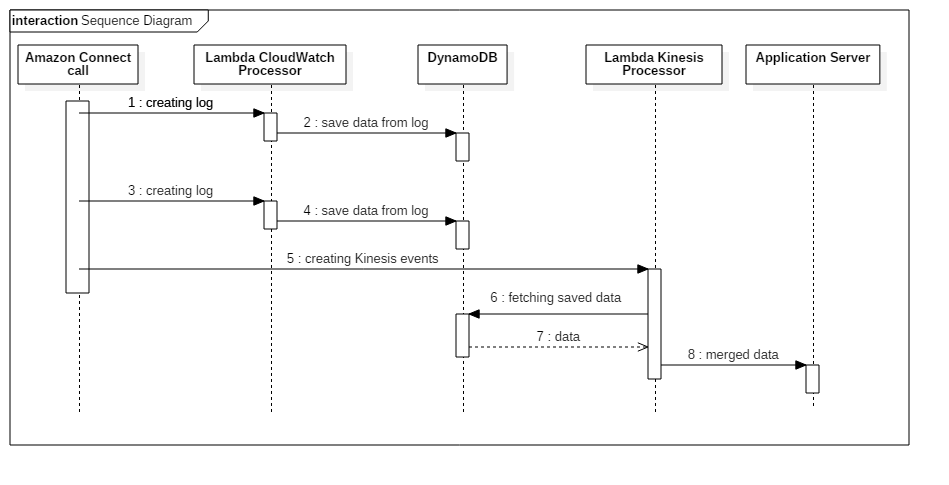
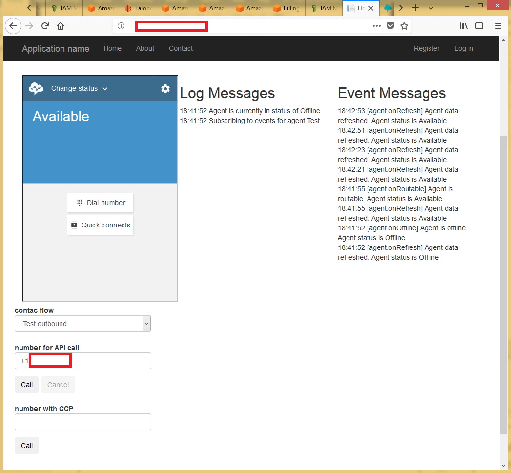

### AWS Connect Streams Sample
This project is created to show how to integrate [Amazon Connect](https://aws.amazon.com/connect/) to web applications with real-time monitoring and logging.
To integrate Contact Control Panel (CCP), we need to use [Amazon Connect Streams](https://github.com/aws/amazon-connect-streams).
Events in each Contact Flow block are sent as logs into [Amazon CloudWatch](https://aws.amazon.com/cloudwatch/) or [Kinesis Streams] (https://aws.amazon.com/kinesis/data-streams/) (or both of them). So Logs about all events during the call are written to these services.

We need to handle all the events. The handler responds to each event, selects the necessary information and sends it to the web server. For example, we use [AWS Lambda](https://aws.amazon.com/lambda/): CloudWatchLogsProcessor for CloudWatch events and KinesisStreamProcessor for KinesisStreams ones.

Since different information about the same event comes from Connect to CloudWatch and KinesisStreams , it needs to be combined. 
We use [Amazon DynamoDB](https://aws.amazon.com/dynamodb/) as intermediate storage to collect information about every single event.
Once the call is over, KinesisStreamProcessor fetches all info related to this call from DynamoDB.
After that, it sends the aggregated, filtered information to the web application.

This process is represented at sequence diagram below.

If you did everything right and pasted your credentials to the appropriate places, this app should look like:

